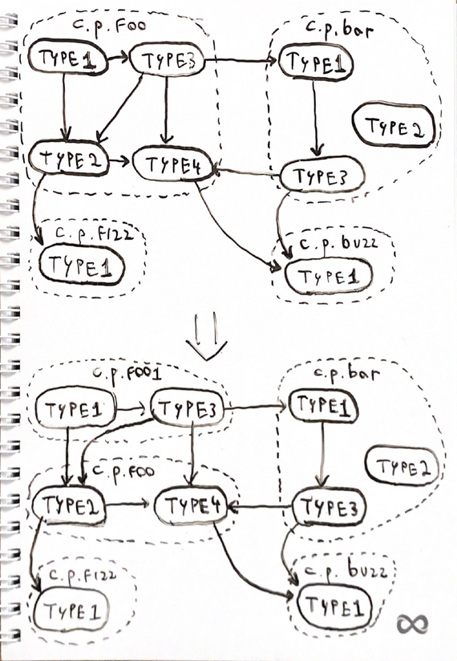
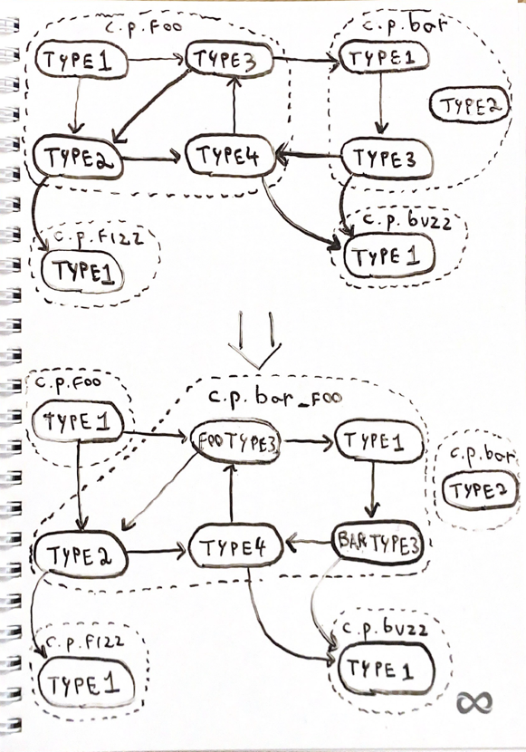

# Removal of package cycles

This package contains functions, algorithms, data structures and tools required to remove all package cycles from a
conjure definition. This is required because with conjure-go v6, each conjure package generates a Go package
and the Go compiler does not admit package cycles.

This document outlines the goals and constraints of this process, the algorithm for removing cycles and the proof for
correctness and optimality for the algorithm within the constraints.

## Glossary

- A **type** is either a conjure object (whether it's an alias for a primitive type, a struct or an union),
error or service. It is denoted as a tuple `(name, package)`.
- A **conjure package** is a package according to the original conjure definition.
- A **Go package** is a package according to the intermediary conjure definition
(that is, it's ready to be compiled to Go).
- A [**graph**](https://en.wikipedia.org/wiki/Graph_(discrete_mathematics)) is a set of **nodes** and **edges**
that connect these nodes.
The number of nodes and edges is normally represented by the variable names `n` and `m`, respectively.
- A [**node** or **vertex**](https://en.wikipedia.org/wiki/Vertex_(graph_theory)) is a unit of a graph.
We'll normally represent nodes with the variable names `u` and `v`.
- An [**edge**](https://en.wikipedia.org/wiki/Glossary_of_graph_theory#edge) connects two nodes on a graph,
that is, between two nodes, there is either an edge or there isn't.
- A **partition** of a graph is a grouping of nodes such as each node of the graph is part of exactly one group.
A partition is deemed minimal according to some condition if it minimizes the number of groups according to
the condition.
- A [**directed graph**](https://en.wikipedia.org/wiki/Directed_graph) is a graph where all edges have a direction.
When an edge has a direction, the edge defines exactly one source node and one destination node.
In this case we say there is an edge from the souce node to the destination node.
- The **type graph** of a conjure definition is a graph where each type represents a node in the graph.
If the type of node `u` is an object or union that references a type of node `v`,
then there is a directed edge from `u` to `v`. 
- A [**path**](https://en.wikipedia.org/wiki/Path_(graph_theory)) on a directed graph is an ordered list of nodes such
that you can go from one to the next traversing edges whose source is the current node and the destination is the
next node.
- A [**cycle**](https://en.wikipedia.org/wiki/Cycle_(graph_theory)) on a directed graph is a path with at least 2
nodes that starts and ends in the same node.
- A [**directed acyclic graph (a.k.a. DAG)**](https://en.wikipedia.org/wiki/Directed_acyclic_graph)
is a directed graph with no cycles.
- A [**strongly connected component (a.k.a. SCC)**](https://en.wikipedia.org/wiki/Strongly_connected_component)
is a maximal subset of nodes in a directed graph such that two nodes belong to the same SCC if and only if
there is a path from one to another. In other words, they are part of a cycle.
They are maximal in a sense that an SCC cannot contain another SCC. SCCs define a partition of a graph,
that is, a node can only be part of a single SCC and there is only a single possible SCC partition.
- The **strongly connected component graph (a.k.a. SCC graph)** is a graph of strongly connected components.
If there is an edge from node `u` to node `v` in the original graph, then either `u` and `v` are part of the same SCC
or there is an edge from the SCC of `u` to the SCC of `v` in the SCC graph. The SCC graph is a DAG because if there
were any cycles in the SCC graph, the SCCs would not be maximal.
- A **package set** is a set of conjure packages. Two package sets are said to be equal if and only if their sets are
equal, that is, if one set contains a package, the other contains that package as well.
The package set of an SCC is the set of all packages of the types that make up the SCC in the type graph.
- A **chain** is a subset of nodes of a DAG such that there is a path in the graph between each pair of nodes in
the chain. A chain corresponds to a path in the DAG.
- An [**antichain**](https://en.wikipedia.org/wiki/Antichain) is a subset of nodes of a DAG such that there is no
path in the graph between each pair of nodes in the antichain.
- A [**topological order**](https://en.wikipedia.org/wiki/Topological_sort) of a DAG is an ordered list of all nodes
such that if there is a path from `u` to `v`, then `u` appears before `v` in the order. There can be more than one
topological orders.

## Goals and constraints

In conjure, types aren't just standalone concepts - they are grouped by what is called "conjure packages".
Each type is part of exactly one conjure package.
This is used to create a logical grouping of concepts that help organize the generated code.
When compiling a conjure definition to a specific language, conjure packages are often translated into that language's
own concept of package.

The problem is that there are constraints that a specific language applies to its package structure that are not valid
per conjure's package definition. One such constraint is that the Go compiler does not admit import cycles,
that is, a file in a package cannot import another package that also directly or indirectly imports the current package.
There is no such restriction in the conjure language that conjure packages cannot form cycles,
which results in some conjure definitions generating Go code that does not compile.

**The ultimate goal of the algorithm proposed here is to create an intermediary conjure definition
during the generation of Go code in order to remove any conjure package cycles.**

One trivial solution would be to compile all conjure packages into a single Go package. However this would represent a
major compile break for all conjure definitions that currently do not have conjure package cycles,
which we believe are the majority of conjure definitions used by Palantir.
We'd like to both (1) not break definitions that do not have conjure package cycles and (2) do a reasonably minimal
change to the conjure definitions that do.

We may consider doing a major revamp of conjure-go that includes major compile breaks, but this is out of scope for the
short term and would require a major version bump for conjure-go v6, which at the time of writing this document is
not in the plans.

Given that, the algorithm proposed below to remove conjure package cycles is also designed to
respect the following constraints:
1. If there are no package cycles in the conjure definition, then the definition remains unchanged.
2. Types cannot be moved between conjure packages of the original definition.
In other words, the Go package a type ends up in is either the original conjure package the type came from
or a brand new one that is generated by the algorithm.
3. The number of new packages in the intermediary conjure definition is minimal respecting the constraints above.
4. The algorithm is stable, that is, if the conjure definition changes and no new conjure package cycles are introduced,
the Go package structure stays the same. In addition, if a new package cycle is introduced, a reasonably minimal
change is done.

Note that we'll not guarantee nor make a best effort to minimize the number of types that are moved out of their
original packages.
The algorithm that minimizes the number of additional Go package gives little room for optimization in that direction.
We expect this to be fine since we don't expect there to be complex package cycles that admit multiple solutions.
In addition, the problem of minimizing the number of types moved out of their package is believed to be NP-hard,
though we don't have formal proof.

## The algorithm

### Summary

There are two types of cycles that can be present in a conjure definition:
- **Non-type cycles** are cycles where there is no cycle in the conjure definition's type graph,
but cycles would be created if all nodes of the same conjure package would be merged.
- **Type cycles** are cycles in the type graph such that there is more than one conjure package
observed over the types that make up the cycle.

The general idea of the algorithm is to break non-type cycles by splitting conjure packages and break type cycles by
moving all types that are part of the cycle into a brand new package. In addition, we'll do a best effort to merge the
resulting packages while respecting the constraints above and not re-creating the cycles we just broke.

The algorithm is then divided into five steps:
1. Build the type graph of the conjure definition.
2. Calculate the strongly connected components of the type graph.
3. Calculate a minimal partition of the SCC graph such that two SCCs can be part of the same group if (1) they have the
same package set and (2) there is no path in the SCC graph from one to the other that crosses an SCC with a different
package set.
4. For each group in the partition, assign a unique Go package name that is derived from the package set of the
SCCs of the group.
5. For each type in the conjure definition, find its SCC from step 2, then find the group it landed in step 3
and modify the package to the unique package name assigned to the group in step 4.
Deduplicate type names within the same Go package as required.
This yields the intermediary conjure definition.

The overall runtime complexity is `O(n^2/64 + ng + m)` where `n` is the number of types, `g` is the minimum number of
Go packages and `m` is the number of edges in the type graph.

### Build the type graph of the conjure definition

This is pretty straightfoward.
The conjure definition is read and for each type that is ever declared or referenced, a new node is added to the
type graph.

The edges of the graph are built according to the following rules:
- If the type represented by node `u` is an alias to another type represented by node `v`, an edge is added
from `u` to `v`.
- If the type represented by node `u` is an object that references another type represented by node `v` in one of its
fields, an edge is added from `u` to `v`.
- If the type represented by node `u` is an union that can be another type represented by node `v`, an edge is added
from `u` to `v`.
- If the type represented by node `u` is an alias to a primitive type or an enum, it contains no outgoing edges.
- If the type represented by node `u` is an alias to a primitive data structure that references another type
represented by node `v` (for example, `list<v>`, `optional<v>` or `set<v>`), an edge is added from `u` to `v`.
- If the type represented by node `u` is an external reference or falls back to a type represented by node `v`,
an edge is added from `u` to `v`.
- If the type represented by node `u` is an error that admits an object of a a type represented by node `v`
as a safe or unsafe param, an edge is added from `u` to `v`.
- If the type represented by node `u` is a service that admits an object of a type represented by node `v`
as a parameter, return value or marker, an edge is added from `u` to `v`.

The type graph can be built in `O(n+m)` runtime and memory.

### Calculate strongly connected components

Why do we use strongly connected components?
From the constraints of the Go compiler, it is imperative that all types within a type cycle belong to the same
Go package. Because of constraint number 2, unless all types within a type cycle are already part of the same conjure
package, they all need to be moved into a brand new package. If a type belongs to more than one cycle,
the types of all such cycles must be moved into the same brand new package.

In conclusion, for each type `u`, the maximal set of types that can reach `u` and can be reached by `u` in the type
graph must belong to the same Go package as `u`. That is exactly the definition of strongly connected components,
so the problem is essentially to look for strongly connected components in order to form new packages. Thinking about
the problem in terms of strongly connected components also introduces a lot of algorithms and theorems known from
graph theory literature.

Each SCC is also assigned a package set that is the union of all packages of the types that make up the SCC.


In order to calculate the strongly connected components we use
[Kosaraju's algorithm](https://en.wikipedia.org/wiki/Kosaraju%27s_algorithm), which runs in `O(n+m)` runtime and memory.

### Partition strongly connected components

At this point, if we assign a Go package to each strongly connected component, we'd already have a valid solution
for the ultimate goal. However, it would not comply with constraints 1 and 3 because if two SCCs originate from the
same package set and there are no paths from one SCC to another that crosses an SCC with a different package set, they
can be assigned with same Go package without creating a Go import cycle.

In other words, we have to calculate a minimal partition (i.e. minimum number of groups) of the SCC graph such that
two SCCs can be part of the same group if (1) they have the same package set and (2) there is no path in the SCC graph
from one to the other that crosses an SCC with a different package set.

#### Calculate disallowed dependencies

First, we need to be able to verify if two SCCs can be part of the same group efficiently.
Let `su` be an SCC. Let `dependencies(su)` be the set of all SCCs that are reachable by `su` in the SCC graph.
Let `disallowed(su)` be the subset of `dependencies(su)` of the SCCs that cannot be grouped with `su`,
that is, `sv` belongs to `disallowed(su)` if and only if there is a path from `su` to `sv` that crosses an SCC with
a package set different than `su`'s.
Checking if two SCCs `su` and `sv` can be grouped together simply means checking if the package set of `su` and `sv`
are equal, `su` is not in `disallowed(sv)` and `sv` is not in `disallowed(su)`.

`dependencies(su)` can be calculated by the following recursive algorithm: Let `sv` be a direct dependent of `su`,
that is, there is an edge from `su` to `sv` in the SCC graph. `sv` is added to `dependencies(su)`.
Because dependencies are transitive, `dependencies(sv)` merges in to `dependencies(su)`.

`disallowed(su)` can be calculated by the following recursive algorithm: Let `sv` be a direct dependent of `su`,
that is, there is an edge from `su` to `sv` in the SCC graph.
- If `su` and `sv` have different package sets, all dependencies of `sv` have a path from `su` to them that cross an
SCC made up a different package set. Therefore, `dependencies(sv)` merges in to `disallowed(su)` and `sv` is added to
`disallowed(su)`.
- If `su` and `sv` have the same package set and `sw` is an SCC in `disallowed(sv)`, then there is a path
from `sv` to `sw` that crosses an SCC of a different package set than `sv`, which means that there is a path
from `su` to `sw` that crosses an SCC of a different package set than `su`, so `sw` is part of `disallowed(su)`
and therefore `disallowed(sv)` merges in to `disallowed(su)`.

Since the merge set operation is `O(n)`, this recursive algorithm takes `O(n^2 + m)` runtime and `O(n^2)` memory with
the merging sets being the bottleneck. We can, however, use the [bitset](https://en.wikipedia.org/wiki/Bit_array)
data structure to represent `dependencies` and `disallowed` and conduct the `O(n)` merges and store the sets
with a multiplicative factor of `1/64`.

Let's define a new DAG with the SCCs called the "disallowed DAG".
The edges are defined by: `su` has an edge to `sv` if and only if they have the same package set
and `sv` is in `disallowed(su)`. The disallowed DAG is a DAG because there is an edge from `su` to `sv`
only if `sv` is part of `disallowed(su)`, which is a subset of `dependencies(su)` and the dependencies
graph is a DAG as a corollary of the SCC graph being a DAG.


In the image above, we see the conversion from the SCC graph to the disallowed graph.
Node 1 is disallowed to merge with node 3 because there is a path from 1 to 3 that crosses node 5,
which has a different package set.
Node 3 is disallowed to merge with node 4 because there is a path from 3 to 4 that crosses node 6,
which has a different package set.
Node 5 is disallowed to merge with node 6 because there is a path from 5 to 6 that crosses node 3,
which has a different package set.
Node 2 is disallowed to merge with node 4 because there is a path from 2 to 4 that crosses node 7,
which has a different package set.

#### Process disallowed graph

Now that we can efficiently check if two SCCs can be grouped, let's actually look for the minimal partition.
Reminder that two SCCs can be grouped if they have the same package set and there isn't an edge from one to another
in the disallowed graph.

The problem then becomes finding a minimal partition of the disallowed graph into antichains. All SCCs in an antichain
can be merged by the restrictions set above.

Let the `depth(su)` be the size of the longest path that starts at node `su` in the disallowed DAG.
The algorithm to partition the DAG into a minimal set of antichains is to simply group nodes by their depths.
If two nodes have the same depth, they can't have a path from one to another because, if such a path existed, it would
cause the node at the end of the path to have a bigger depth than the one at the start.
Such a partition yields one antichain for each possible depth, which according to
[Mirsky's theorem](https://en.wikipedia.org/wiki/Mirsky%27s_theorem), yields a minimal partition into antichains
as there would be one antichain for each node of the longest chain.

If we implement that algorithm as is, we'll have to build the disallowed DAG, which contains `O(n^2)` edges.
A smarter implementation is to do it in place in the SCC graph by maintaining a list of buckets for each package set
that represents the current Go packages. The buckets are ordered by the depth of the associated antichain that the
SCCs are part of. We can then greedily process SCCs in reverse topological order and drop it in the first bucket that
admits it. This runs in `O(ng)` where `g` is the minimum number of Go packages.


In the image above, an example of the decomposition of a DAG into antichains according to depth.
Each node is inserted into the antichain whose index matches its depth.

With this algorithm, we can already find a minimal partition that yields the minimal number of Go packages,
satisfying constraint 3. In addition, if there are no conjure package cycles, the disallowed graph has no edges
so all SCCs belong to the same antichain and therefore are assigned to a single Go package, satisfying constraint 1.

### Assign Go package names

Once we have the SCC partition, we can merge all the SCCs in the same group to form a single Go package.
By the conditions of the partition, two SCCs are selected to be grouped only if their package set is equal.
Because of this, the name of the final Go package only needs to be a function of the package set.

Conjure packages are named with multiple terms separated by periods. Each term translates to a directory in the
resulting Go code with the final word being the Go package name.

The algorithm for calculating a reasonable merged package name is defined as follows:
1. Calculate the maximum word prefix for all merging conjure packages in the package set.
That is, the maximum prefix common to all packages that ends with a period.
2. For each merging conjure package name, remove the prefix and any other period.
3. Merge the merging conjure package names into a single string in lexicographical order. Separate by underscore `_`.
4. Prepend the common prefix.

For example,
```json
[
  "com.palantir.foo",
  "com.palantir.bar"
]
```
becomes
```json
"com.palantir.bar_foo"
```
and
```json
[
  "com.palantir.api",
  "com.palantir.root.foo",
  "com.palantir.root.bar"
]
```
becomes
```json
"com.palantir.api_rootbar_rootfoo"
```

In addition, we'll need to de-duplicate any types with conflicting names in the merging conjure packages.
We'll do it by prepending the original conjure package name to the type name if a type is present more than one time
in the Go package.
If we've already seen a type of the same name, we append number starting from 1 and increasing each time.

For example,
```json
[
  "com.palantir.a:Foo",
  "com.palantir.b:Foo"
]
```
becomes
```json
[
  "com.palantir.a_b:AFoo",
  "com.palantir.a_b:BFoo"
]
```

### Create the intermediary definition

Finally, we can build a map from the old tuple `(package,name)` to a new tuple `(package,name)`
using the modifications described in the step above. If more than one Go package shares the same package name and path,
we'll iterate over Go packages in the increasing order of antichain depth and, if we see a package
we've seen before, append a number starting from 1 and increasing each time.
The reason we chose the antichain order is to ensure stability of the algorithm: the assigned package name will only
change if the disallowed DAG changes, and that only happens when a new conjure package cycle is introduced.

For example,
```json
[
  "com.palantir.foo",
  "com.palantir.foo"
]
```
becomes
```json
[
  "com.palantir.foo",
  "com.palantir.foo1"
]
```

Then, we just need to iterate over the entire definition and apply the map on every reference to a type we see.
The definition can then be handed off to the rest of the generation algorithm,
which doesn't have to care about any of this.

## Test cases

In order to better illustrate and to build maintainable unit tests, 4 test cases were included in the [testdata
directory](./testdata) with an illustration, expected input and output conjure definitions and the generated code.
Let's go over each one of them to explain what is going on.

### No cycles

This test case contains a conjure definition with neither type or non-type cycles.


Each node in the type graph yields its own SCC. Each SCC is made up of a unitary package set.
The SCC graph is equal to the type graph. `disallowed` is empty for all SCCs, so the disallowed DAG has no edges.
Because of this, there is a single antichain for each package set, so all SCCs of the same unitary package set
are grouped to form the same Go package, which will be equal to the lonely conjure package in the unitary package set.
Because no conjure packages need to be merged, no types need to be renamed.
The resulting definition is exactly the same as the original one.

### Cycle within package

This test case contains a conjure definition with a package `com.palantir.foo` that contains a cycle of types.


All nodes in the type graph for package `com.palantir.foo` are brough to the same SCC.
Every other node gets its own SCC. Each SCC is made up of a unitary package set.
There is exacly one node for each package set in the SCC graph. `disallowed` is empty for all SCCs,
so the disallowed DAG has no edges.
Because of this, there is a single antichain for each package set, so all SCCs of the same unitary package set
are grouped to form the same Go package, which will be equal to the lonely conjure package in the unitary package set.
Because no conjure packages need to be merged, no types need to be renamed.
The resulting definition is exactly the same as the original one.

### Non-type cycle

This test case contains a conjure definition with a non-type cycle, e.g. a conjure package cycle without type cycles.



Each node in the type graph yields its own SCC. Each SCC is made up of a unitary package set.
The SCC graph is equal to the type graph.
`disallowed` for the SCCs that contain `com.palantir.foo:Type1` and `com.palantir.foo:Type2` contain the SCC that
contains `com.palantir.foo:Type4`, because there is a path from the former types to the latter that pass through
a type of a different package set (`{com.palantir.bar}`).
Because of this, there are two antichains in the disallowed DAG for package set `{com.palantir.foo}`.
Here, the SCC that contains `com.palantir.foo:Type3` can choose to join the Go package of `com.palantir.foo:Type1/2`
or the Go package of `com.palantir.foo:Type4`. Because we process SCCs in reverse topological order and always place
them in the deepest allowed antichain, it ends up joining the latter.
The Go package that contains `com.palantir.foo:Type1/3` is renamed to `com.palantir.foo1` to deconflict.
The reason this is the package chosen is because names are assigned in increasing order of depth.
The resulting definition has one more package.

### Type cycles

This test case contains a conjure definition with a type cycle.



Types `com.palantir.foo:Type2/3/4` and `com.palantir.bar:Type1/2` are grouped to the same SCC with package set
`{com.palantir.foo,com.palantir.bar}`. Every other node gets their own SCC.
There is exacly one node for each package set in the SCC graph. `disallowed` is empty for all SCCs,
so the disallowed DAG has no edges.
Each SCC is grouped into an unitary antichain in the disallowed DAG and therefore gets their own Go package.
The SCC that contains package set `{com.palantir.foo,com.palantir.bar}` receives the Go package `com.palantir.bar_foo`.
Because it contains two types named `Type3`, `com.palantir.foo:type3` is renamed to `com.palantir.barfoo:FooType3`
and `com.palantir.bar:type3` is renamed to `com.palantir.barfoo:BarType3`.
The resulting definition has one more package.
